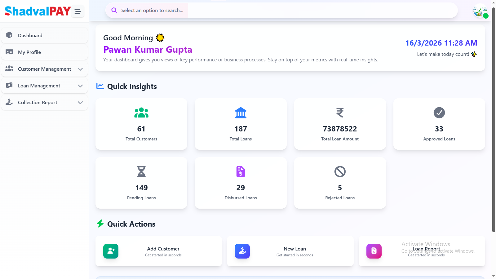
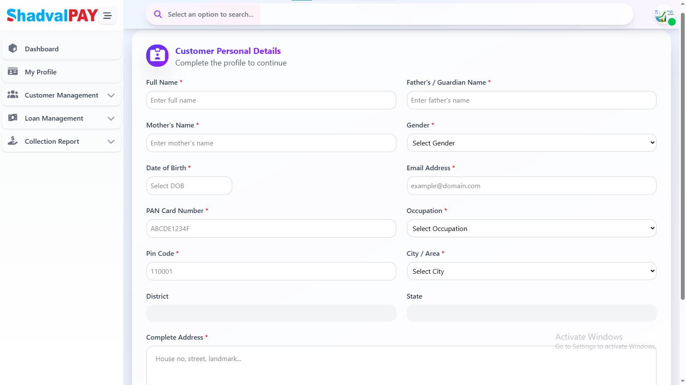
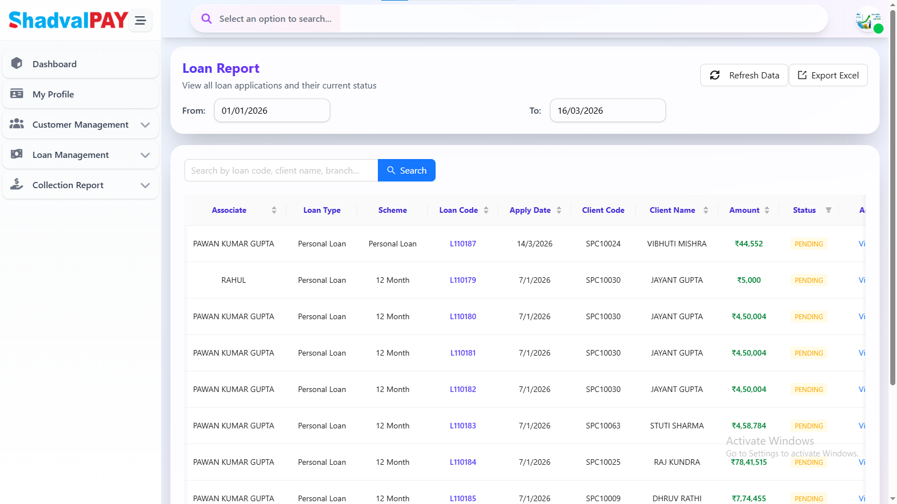
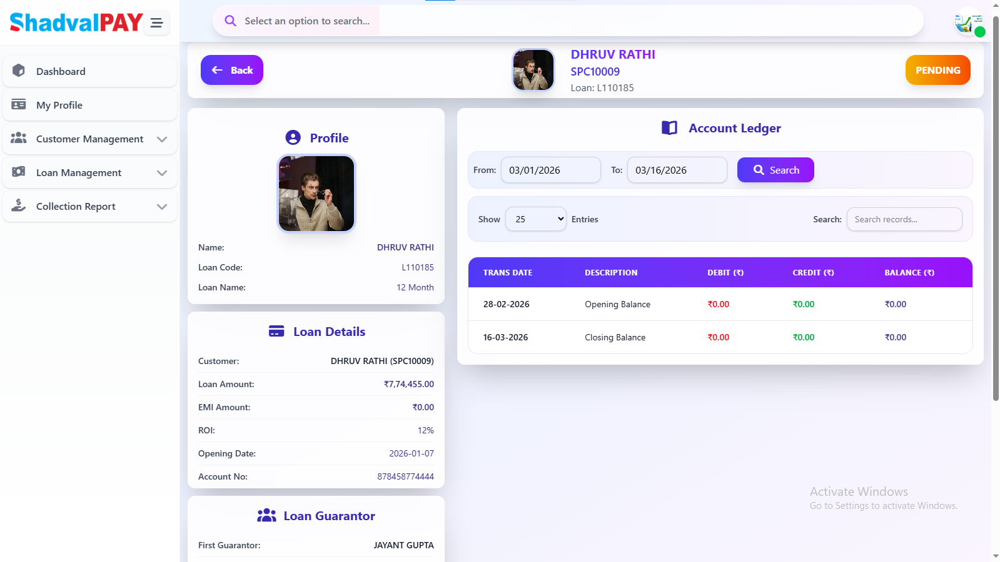

# 💰 Shadval Microfinance Portal

A **web-based microfinance management system** designed to manage the **complete loan lifecycle**, including customer onboarding, loan applications, approvals, and loan disbursement tracking.

The platform is built primarily for **company associates**, enabling them to efficiently manage customers, verify identity details, evaluate loan eligibility, and track loan activities through a centralized dashboard.

---

# 🌐 Live Demo

**Live Application**
https://microfin-demo-react.shadvalpay.co.in

---

# 📸 Screenshots

### Dashboard



### Customer Onboarding



### Loan Application



### Loan Tracking



---

# 🚀 Features

### 👥 Customer Onboarding

* Register new customers
* Capture identity and personal details
* Manage customer records

### 💳 Loan Application Management

* Submit loan applications
* Evaluate loan eligibility
* Manage approval workflows

### 📊 Centralized Dashboard

* View total loans
* Monitor customer statistics
* Track loan activities in real time

### 🏦 Loan Lifecycle Tracking

* Loan approval process
* Loan disbursement monitoring
* Loan record management

### 🔐 Secure System

* Backend API integration
* Secure financial data handling
* Scalable architecture

---

# 🛠️ Tech Stack

### Frontend

* React.js
* Vite
* JavaScript
* CSS

### Backend

* Node.js
* Express.js

### APIs

* .NET Web APIs

### Database

* MySQL

---

# 📂 Project Structure

```
microfinance
│
├── client                # React Frontend
│   ├── public
│   ├── src
│   ├── .env
│   ├── package.json
│   └── vite.config.js
│
├── server                # Node.js Backend
│   ├── config            # Configuration files
│   ├── controllers       # Business logic
│   ├── middlewares       # Custom middleware
│   ├── routes            # API routes
│   ├── utils             # Utility functions
│   ├── uploads           # File uploads
│   ├── .env
│   └── index.js
│
└── README.md
```

---

# ⚙️ Installation & Setup

### 1️⃣ Clone the Repository

```bash
git clone https://github.com/Im-Rahul-Panchal/Microfinance-ShadvalPay.git
```

### 2️⃣ Navigate to Project Folder

```bash
cd shadval-microfinance
```

---

## Start Backend Server

```bash
cd server
npm install
npm run dev
```

---

## Start Frontend

```bash
cd client
npm install
npm run dev
```

---

# 🔑 Environment Variables

Create `.env` files in both **client** and **server**.

### Example Server `.env`

```
PORT=5000
DATABASE_URL=your_database_url
JWT_SECRET=your_secret_key
```

---

# 🎯 Project Purpose

The goal of this platform is to **digitize microfinance operations** and help organizations:

* Manage customers efficiently
* Track loan applications
* Monitor loan approvals and disbursements
* Gain operational insights through dashboards

---

# 👨‍💻 Author

**Your Name**

GitHub:
https://github.com/Im-Rahul-Panchal

---
